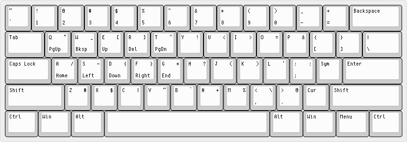

``3l-symbols`` - A symbols layer for QWERTY
===========================================

What is ``3l-symbols``?
-------------------

``3l-symbols`` could be considered an alternative keyboard layout. It uses the
QWERTY letter keys, but improves coding ergonomics by including the symbol and
cursor layers from `Jack Rosenthal's 3l layout`_. Note that use of the symbols
layer is required, because certain symbol keys are replaced by the modifier keys
that give access to the symbol and cursor layers, so the only way to type those
symbols is with the symbols layer.  

.. _`Jack Rosenthal's 3l layout`: https://github.com/jackrosenthal/threelayout

``3l-symbols`` is currently implemented only for Linux and Windows. The Windows
version is untested; feel free to tell me about any issues you find.  I can't
really see wanting to make a Mac version myself, but maybe someone else will.
If you want to try, be warned: the Linux, FreeBSD, and Windows implementations
of ``3l`` (the reference layout for this one) are all under 300 lines, but the
Mac OS X implementation is over 2500--try at your own risk.  Having looked at
the FreeBSD implementation of ``3l``, I don't think this layout is worth
implementing in FreeBSD due to the way shortcomings in its keyboard drivers
hamper its ability to add layers.

The Sym layer includes the symbols on the upper right of the keys, while the Cur
layer includes the symbols on the bottom of Q-T and A-G.

No other keys are changed; without the modifiers held down the layout is normal
QWERTY (except that the characters normally typed by the modifier keys will not
work).  This includes the comma, period, and semicolon keys--they are not moved
by this layout.  This also includes the whole left column of keys--Tab, Caps,
etc. I personally run an xmodmap on top of this layout that remaps those keys,
but you can do what you like, including nothing at all.

Motivation (brief)
------------------

Switching to a new keyboard layout is hard. It is difficult enough to switch for
typing regular letters, but in my experience, it is far more difficult to switch
to an alternative layout if you are highly familiar with a set of keybindings,
such as those provided by a text editor such as Vim (my personal experience).
Additionally, switching to a new layout provides dubious speed benefits (in my
opinion). However, the symbols and cursors layers provided by such keyboard
layouts as ``3l`` or `Neo`_ (from which ``3l`` itself derives much of its
versions of these layers) are still highly useful, and are far less difficult to
switch to due to the lower frequency of these characters
and the lack of keybindings involving them.

.. _`Neo`: http://neo-layout.org/index_en.html

This layout is intended to make typing code or other symbol-intensive things
more ergonomic and easier by providing symbols in an easier-to-reach place by
providing a symbols layer. It should not make a big difference to speed in
either direction if what is being typed is not symbol-intensive. It also
provides a cursor layer, which includes arrow, navigation, and delete keys on or
near home row.

For a more extensive argument about why you should use a symbols layer for
QWERTY rather than using a more extreme alternative layout or using QWERTY
without a symbols layer, please see ``extended-motivation.pdf``.

Testing the layout without installation
---------------------------------------

On Linux using X, you can run ``linux/xmodmap/test_layout.sh`` from the base of
this repository to temporarily set your keyboard layout. To undo this, you can
either type ``setxkbmap us``, or it will return back to normal next time you log
out and back in.

On Windows, compile and run the provided AHK script. Your keyboard layout will
return to normal when the script exits (in the system tray) or you press both
``Alt`` keys at the same time.

Installation
------------

Linux
~~~~~

Place the ``linux/xkb/symbols/3ls`` file in your system's ``symbols`` directory
[1]_, then either:

1. Run ``setxkbmap 3ls`` to set the layout *temporarily*.
2. Or, to set ``3l-symbols`` as the *default keyboard layout* for your system,
   add a section to your X11 configuration::

       $ cat /etc/X11/xorg.conf.d/99-keyboard.conf
       Section "InputClass"
               Identifier "system-keyboard"
               MatchIsKeyboard "on"
               Option "XkbLayout" "3ls"
       EndSection

   ``systemd`` has the ``localectl`` utility that you may optionally use to
   maintain this configuration file.

To create a console mapping from the ``xkb`` symbols file, you can use the
``ckbcomp`` utility.

.. [1] This is typically something like ``/usr/share/X11/xkb/symbols``.

Windows
~~~~~~~

Place the AHK script in your "Startup" folder.

